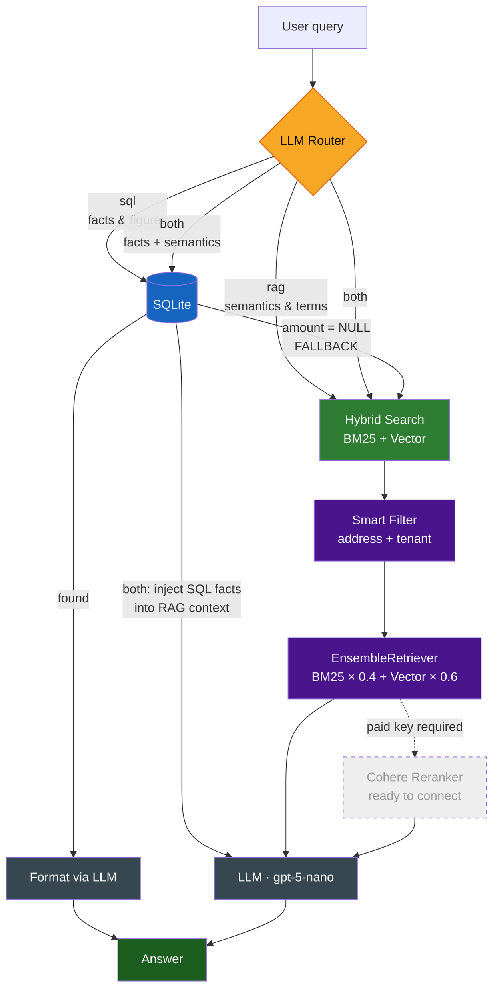

<div align="center">

__English__ | [__Русский__](README.ru.md)

# 🏢 Hybrid RAG · Lease Document Analysis System


<br/>

**Hybrid RAG system with SQL routing for lease document analysis in Russian**

*From legal practice to LLM Engineering. Real data. Real problems. Real solutions.*

<br/>

[Architecture](#-architecture) · [Challenges & Solutions](#-challenges--solutions) · [Quick Start](#-quick-start) · [Roadmap](#-roadmap)

</div>

---

## 🎯 LegalTech Challenge

> How do you instantly find an indexation clause across 800+ lease agreements — without spending weekends reading documents?

This project automates property management workflows, guaranteeing **100% accuracy on financial data** by separating logic layers: facts go to SQL, semantics go to vector search.

Standard tutorial RAG breaks on the very first real document. The same person appears in five different forms: "IP Ivanova", "Ivanova V.V.", "Ivanova" — one tenant or three? Vector search cannot answer "how much does Petrov pay?" — it retrieves similar text, not exact figures.

This is what happens **when naive RAG meets reality**.

---

## ✨ Demo

```python
ask("List of tenants at Lenina 115?")
# → [SQL] tenant list with offices — instant, zero hallucinations

ask("How much does Petrov pay?")
# → [SQL] found: 18,800 RUB/month from Excel acts

ask("How much does Tochka Rosta pay?")
# → [SQL] empty → auto-fallback → [RAG] searches contract text

ask("Termination conditions for Kravtsov")
# → [RAG + filter] only Kravtsov's documents, zero foreign contracts

ask("Floor area for Starlit")
# → [RAG] finds "64.6 sq.m" in clause 1.1 of December 2024 lease
```

---

## 🏗 Architecture



**When does `both` trigger?** When a query contains both a factual and a semantic component simultaneously — e.g. *"Who rents office 5 and what are the termination conditions?"*. SQL returns the tenant, RAG retrieves the contract clause, and LLM merges both into a single coherent answer.

### Two-layer data model

| Query type | Layer | Guarantee |
|------------|-------|-----------|
| Who rents? How much? List? | **SQLite** | Exact figures, no hallucinations |
| Contract terms? Clauses? Procedure? | **ChromaDB + BM25** | Semantic text retrieval |
| Who rents office 5 and on what terms? | **SQL + RAG** | Composite answer |

---

## ⚙️ Indexing Pipeline

The system re-indexes the entire document base on each pipeline run — any new file added to the folder is automatically picked up, parsed, and written to both SQLite and ChromaDB without manual intervention.

**Under the hood:**

- `os.remove(knowledge.db)` + full directory scan on every run — guarantees the structured layer always reflects the current state of the file system
- `source` field as a **unique key** — each document is identified by its full path, preventing duplicates via `INSERT OR IGNORE`
- `zip_longest` for multi-tenant receipts — robust against mismatched list lengths (3 tenant names, 2 amounts — no crash, gaps filled with `None`)
- **Adaptive `k` in retriever** — aggregation queries ("list all tenants") automatically receive more candidate documents than point queries
- `FALLBACK_TO_RAG` as an **explicit string signal** between layers — clean inter-layer communication without exceptions or silent failures
- 3-level NER fallback ensures every document gets a tenant label: `RegEx → Natasha NLP → filename`

---

## 💡 Challenges & Solutions

These are the decisions that separate production thinking from tutorial code.

### 🔴 Challenge 1: The "Maksim Viktorovich" Problem

Natasha NER reliably found names — but sometimes returned the **signatory** instead of the tenant. "Ivanov Maksim Viktorovich" is the director signing on behalf of LLC "Starlit", not the tenant itself.

**✅ Solution:** `ORG > PER` priority. When both an organization and a person appear near the anchor phrase "hereinafter referred to as Tenant", we take the organization. Role stop-list: "director", "accountant", "IFNS", "MVD". A person is extracted only if no organization is found.

---

### 🔴 Challenge 2: Excel Cannot Be Split

`RecursiveCharacterTextSplitter` cuts every document into 1,500-character chunks. For a financial act this is catastrophic: "Customer: IP Petrov" lands in one chunk, "Total due: 18,800 RUB" in another. The model sees a number with no name attached.

**✅ Solution:** Excel files are stored **whole**, without chunking. Only `.docx` and `.txt` files go through the splitter. Financial table integrity is guaranteed.

---

### 🔴 Challenge 3: Dead-end "No Data" Responses

SQL does not always contain a monetary amount (`amount = NULL` — the parser did not extract a figure from the contract body). A naive system would respond "data not found".

**✅ Solution:** Automatic `SQL → RAG` fallback. When SQL returns `FALLBACK_TO_RAG`, the system silently switches and searches the contract text for "rental payment". The user always receives an answer.

---

### 🔴 Challenge 4: Foreign Documents in Context

Without filtering, a query about Antokhin would pull in Markov's contracts from Lenina 115 and invoices from a different property on Mira 311. The LLM would mix up data from different tenants and addresses.

**✅ Solution:** Tenant filter applied **before search**, not after. BM25 and Vector operate only on documents belonging to the queried tenant. Context isolation enforced at the retriever level.

---

### 🔴 Challenge 5: Multi-tenant Receipt Files

A single receipt file contains 4–5 tenants. A "one file = one record" approach in SQLite makes it impossible to query a specific payer's amount.

**✅ Solution:** A dedicated `receipt_entries` table. Each payer gets its own row with amount and period. `zip_longest` guards against mismatched list lengths.

---

## 📊 Document Parsing

**7 document types, each with a dedicated parser:**

| Type | Format | Extracted fields |
|------|--------|-----------------|
| `lease_contract` | .docx | tenant, address, office, year |
| `act_excel` | .xls/.xlsx | tenant, amount, period |
| `invoice_excel` | .xls/.xlsx | buyer, amount |
| `invoice_docx` | .docx | buyer, offices, amount |
| `receipt` | .docx | all payers + amounts |
| `utility_invoice` | .docx | offices, utility amounts |
| `agreement_termination` | .docx | tenant, termination date |

**3-level tenant extraction fallback:**
```
1. RegEx       →  fast, precise for standard clause forms
2. Natasha NLP →  flexible, handles non-standard phrasing
3. Filename    →  last resort, better than "UNDEFINED"
```

---

## 🛠 Tech Stack

```
LLM            OpenAI gpt-5-nano
Embeddings     text-embedding-3-small
Vector DB      ChromaDB
Keyword        BM25 (rank-bm25)
Structured     SQLite
NER            Natasha (Russian-language NER standard)
Reranker       Cohere rerank-multilingual-v3.0  ← ready, trial key unsupported
Framework      LangChain (classic + community)
Documents      python-docx · openpyxl · xlrd
```

---

## 🗺 Roadmap

```
✅  Level 1    Basic RAG from tutorial
✅  Level 2    Real unstructured data (343 files, 7 document types)
✅  Level 3    Hybrid search BM25 + Vector
✅  Level 4    Metadata extraction + context filtering
✅  Level 5    Router + SQL layer for factual queries
⏳  Level 6    Cohere Reranker  ← infrastructure ready, requires paid API key
⏳  Level 7    Semantic Chunking — split by logical paragraph blocks, not character count
⏳  Level 8    Evaluation Pipeline — RAGAS metrics (precision / recall / faithfulness)
⏳  Level 9    Local LLMs via QLoRA fine-tuning for the legal domain
                → RAG vs fine-tuned model comparison coming here
```

> Levels 7 and 8 require no architectural rewrite — semantic chunking is a single splitter swap; evaluation is a single added module.

---

## 🚀 Quick Start
> **Environment:** Jupyter Notebook · Anaconda (Python 3.10+)
```bash
# Clone
git clone https://github.com/your-username/hybrid-rag-lease-analysis
cd hybrid-rag-lease-analysis

# Install dependencies
pip install -r requirements.txt

# Configure keys
cp .env.example .env
# Add: OPENAI_API_KEY and optionally COHERE_API_KEY
```

**Run:** execute notebook cells strictly in order `0 → 1 → 2 → ... → 9`

```python
# Example queries
ask("Who rents at Lenina 115?")
ask("Termination conditions for Ivanov")
ask("Floor area for Starlit")
```

> ⚠️ Documents and `knowledge.db` are excluded from the repository — they contain personal tenant data.

---

## 👤 About

Career path: **legal practice → LLM Engineering**.

This project sits at the intersection of two domains. Understanding legal documents from the inside made it possible to build a parser that does not confuse a tenant with their accountant. Understanding LLM architecture meant not stopping at the first working prototype.

Full cycle completed: real data → real problems → real solutions. Not a tutorial.

**Current focus:** Fine-tuning · LoRA / QLoRA · Local LLMs

---

<div align="center">

If you found this project useful or interesting — ⭐ is welcome

</div>
