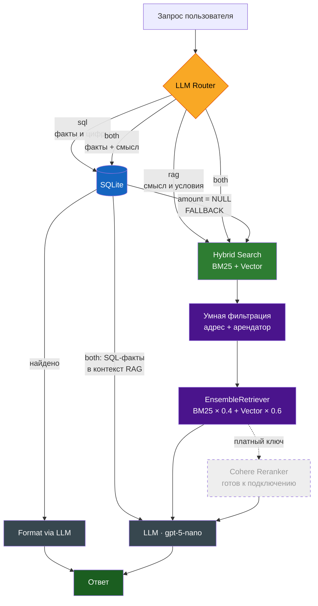

<div align="center">

[__English__](README.md) | __Русский__

# 🏢 Hybrid RAG · Система анализа арендных документов


<br/>

**Гибридная RAG-система с SQL-маршрутизацией для анализа юридических документов на русском языке**

*От юридической практики — к LLM Engineering. Реальные данные. Реальные проблемы. Реальные решения.*

<br/>

[Архитектура](#-архитектура) · [Challenges & Solutions](#-challenges--solutions) · [Быстрый старт](#-быстрый-старт) · [Дорожная карта](#-дорожная-карта)

</div>

---

## 🎯 LegalTech Challenge

> Как мгновенно найти пункт об индексации в 800+ договорах, не тратя время на чтение документов?

Этот проект автоматизирует рутину управляющего недвижимостью — гарантируя **100% точность финансовых данных** за счёт разделения слоёв логики: факты идут в SQL, смысл — в векторный поиск

Стандартный RAG ломается на первом же реальном документе. Одно и то же лицо встречается в пяти формах: «ИП Иванова», «Иванова В.В.», «Иванова» — один арендатор или три? Векторный поиск не умеет отвечать «сколько платит Петров?» — он ищет похожий текст, а не точные цифры

Гибридный RAG превращает нейросеть в педантичного юриста-аналитика, который проверяет каждый факт по двум независимым источникам: базе данных и тексту оригинала

---

## ✨ Демонстрация

```python
ask("Список арендаторов на Ленина 115?")
# → [SQL] список арендаторов с офисами — мгновенно, без галлюцинаций

ask("Сколько платит Петров?")
# → [SQL] найдено: 18 800 руб./мес. из актов Excel

ask("Сколько платит Точка роста?")
# → [SQL] пусто → авто-fallback → [RAG] ищет в тексте договора

ask("Условия расторжения с Кравцовым")
# → [RAG + фильтр] только документы Кравцова, ноль чужих договоров

ask("Площадь помещения Старлит")
# → [RAG] находит «64.6 кв.м» в п.1.1 договора аренды декабрь 2024
```

---

## 🏗 Архитектура



**Когда срабатывает `both`?** Когда запрос содержит одновременно фактовую и смысловую части — например *«Кто арендует офис 5 и каковы условия расторжения?»*. SQL возвращает арендатора, RAG извлекает пункт договора, LLM объединяет оба источника в единый ответ.

### Принцип двух слоёв

| Тип вопроса | Слой | Гарантия |
|------------|------|----------|
| Кто арендует? Сколько? Список? | **SQLite** | Точные цифры, нет галлюцинаций |
| Условия договора? Пункты? Порядок? | **ChromaDB + BM25** | Смысловой поиск по тексту |
| Кто арендует офис 5 и на каких условиях? | **SQL + RAG** | Комплексный ответ |

---

## ⚙️ Индексация документов

Система переиндексирует всю базу при каждом запуске пайплайна — любой новый файл добавленный в папку автоматически подхватывается, парсится и записывается в SQLite и ChromaDB без ручного вмешательства.

**Как это устроено внутри:**

- `os.remove(knowledge.db)` + полный обход директории при каждом запуске — гарантирует что структурированный слой всегда отражает актуальное состояние файловой системы
- Поле `source` как **уникальный ключ** — каждый документ идентифицируется по полному пути, дубли исключены через `INSERT OR IGNORE`
- `zip_longest` для квитанций с несколькими плательщиками — устойчив к несовпадению длин списков (3 имени, 2 суммы — не падает, пробелы заполняются `None`)
- **Адаптивный `k` в retriever** — агрегирующие запросы («список всех арендаторов») автоматически получают больше документов-кандидатов чем точечные запросы
- `FALLBACK_TO_RAG` как **явный строковый сигнал** между слоями — чистая межслойная коммуникация без исключений и молчаливых сбоев
- 3-уровневый NER fallback гарантирует что каждый документ получит метку арендатора: `RegEx → Natasha NLP → имя файла`

---

## 💡 Challenges & Solutions

Именно эти решения отличают production-thinking от tutorial-code.

### 🔴 Challenge 1: Проблема «Максима Викторовича»

Natasha NER находила имена — но иногда возвращала **подписанта**, а не арендатора. «Иванов Максим Викторович» — директор подписывающий от имени ООО «Старлит», а не сам арендатор.

**✅ Solution:** Приоритет `ORG > PER`. Если рядом с якорем «именуемый в дальнейшем Арендатор» есть и организация и физлицо — берём организацию. Стоп-список ролей: «директор», «бухгалтер», «ИФНС», «МВД». Физлицо — только если организации нет совсем.

---

### 🔴 Challenge 2: Excel нельзя резать

`RecursiveCharacterTextSplitter` режет все документы на чанки по 1500 символов. Для финансового акта это катастрофа: «Заказчик: ИП Петров» в одном чанке, «Итого к оплате: 18 800 руб.» — в другом. Модель видит цифру без имени.

**✅ Solution:** Excel-файлы хранятся **целиком**, без нарезки. Только `.docx` и `.txt` проходят через сплиттер. Целостность финансовых таблиц гарантирована.

---

### 🔴 Challenge 3: Тупиковые ответы «данных нет»

SQL не всегда содержит сумму (`amount = NULL` — парсер не извлёк цифру из текста договора). Наивная система ответила бы «данных нет».

**✅ Solution:** Автоматический fallback `SQL → RAG`. Если SQL возвращает `FALLBACK_TO_RAG` — система молча переключается и ищет «арендная плата» в тексте документа. Пользователь всегда получает ответ.

---

### 🔴 Challenge 4: Чужие документы в контексте

Без фильтрации при вопросе про Антохина в контекст попадали договоры Маркова с ул. Ленина 115 и счета с другого адреса по ул. Мира 311. LLM путалась и давала неверные ответы.

**✅ Solution:** Фильтр по арендатору применяется **до поиска**, не после. BM25 и Vector работают только по документам нужного арендатора. Изоляция контекста на уровне retriever.

---

### 🔴 Challenge 5: Квитанции с несколькими плательщиками

Один файл квитанции содержит 4-5 арендаторов. «Один файл = одна запись» в SQLite делает невозможным точный поиск по конкретному плательщику.

**✅ Solution:** Отдельная таблица `receipt_entries`. Каждый плательщик — отдельная строка с суммой и периодом. `zip_longest` защищает от несовпадения длин списков.

---

## 📊 Парсинг документов

**7 типов с отдельными парсерами:**

| Тип | Формат | Извлекается |
|-----|--------|-------------|
| `lease_contract` | .docx | арендатор, адрес, офис, год |
| `act_excel` | .xls/.xlsx | арендатор, сумма, период |
| `invoice_excel` | .xls/.xlsx | покупатель, сумма |
| `invoice_docx` | .docx | покупатель, офисы, сумма |
| `receipt` | .docx | все плательщики + суммы |
| `utility_invoice` | .docx | офисы, коммунальные суммы |
| `agreement_termination` | .docx | арендатор, дата расторжения |

**3-уровневый fallback при извлечении арендатора:**
```
1. RegEx       →  быстро, точно для типовых форм
2. Natasha NLP →  гибко, для нестандартных формулировок
3. Имя файла   →  крайний случай, лучше чем «НЕ ОПРЕДЕЛЁН»
```

---

## 🛠 Технологический стек

```
LLM            OpenAI gpt-5-nano
Embeddings     text-embedding-3-small
Vector DB      ChromaDB
Keyword        BM25 (rank-bm25)
Structured     SQLite
NER            Natasha (русскоязычный стандарт)
Reranker       Cohere rerank-multilingual-v3.0  ← готов, триал ключ не поддерживается
Framework      LangChain (classic + community)
Documents      python-docx · openpyxl · xlrd
```

---

## 🗺 Дорожная карта

```
✅  Уровень 1    RAG из туториала
✅  Уровень 2    Реальные данные (343 файла, 7 типов документов)
✅  Уровень 3    Гибридный поиск BM25 + Vector
✅  Уровень 4    Метаданные + контекстная фильтрация
✅  Уровень 5    Router + SQL-слой для фактовых запросов
⏳  Уровень 6    Cohere Reranker  ← инфраструктура готова, нужен платный ключ
⏳  Уровень 7    Semantic Chunking — нарезка по логике абзацев, не по символам
⏳  Уровень 8    Evaluation Pipeline — RAGAS метрики (precision/recall/faithfulness)
⏳  Уровень 9    Local LLMs через QLoRA дообучение под юридический домен
                  → сравнение RAG vs Fine-tuned модели будет здесь
```

> Уровни 7 и 8 не требуют переписывания системы — Semantic Chunking это замена одного сплиттера, Evaluation Pipeline это добавление одного модуля оценки.

---

## 🚀 Быстрый старт
> **Среда запуска:** Jupyter Notebook · Anaconda (Python 3.10+)
```bash
# Клонировать
git clone https://github.com/your-username/hybrid-rag-lease-analysis
cd hybrid-rag-lease-analysis

# Зависимости
pip install -r requirements.txt

# Настроить ключи
cp .env.example .env
# Добавить: OPENAI_API_KEY и опционально COHERE_API_KEY
```

**Запуск:** ячейки ноутбука строго по порядку `0 → 1 → 2 → ... → 9`

```python
# Примеры запросов
ask("Кто арендует на Ленина 115?")
ask("Условия расторжения с Ивановым")
ask("Площадь помещения Старлит")
```

> ⚠️ Документы и `knowledge.db` в репозиторий не включены — персональные данные арендаторов.

---

## 👤 Об авторе

Переход: **юридическая практика → LLM Engineering**.

Этот проект — точка пересечения двух миров. Понимание юридических документов изнутри позволило построить парсер который не путает арендатора с его бухгалтером. Понимание LLM-архитектур позволило не останавливаться на первом рабочем прототипе.

Прошёл полный цикл: реальные данные → реальные проблемы → реальные решения. Не туториал.

**Текущий вектор:** Fine-tuning · LoRA / QLoRA · Local LLMs

---

<div align="center">

Если проект оказался полезным или интересным — ⭐ приветствуется

</div>
